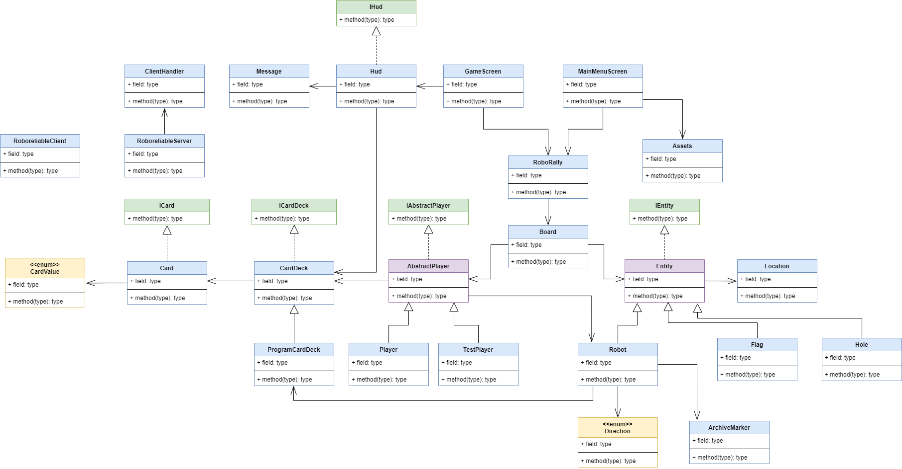

# Deloppgave 1

Vi valgte gruppenavnet **RoboReliables**. Grunnen til dette er fordi målet vårt 
er å levere pålitelig kode som funker.

### Oppsumering av kompetansenivå til teamet

**Sebastian** (Nettverksansvarlig):
- Går hybridutdanning med Informatikk og Dataingeniør
- Faglig styrke: Java, Python, SQL, Cryptologi, Anti-hacking, Sikkerhet
- Softskills: Ledelse fra LAN, samarbeid i prosjekt og lærer på front-end kurs

**Heming** (Arkitekt):
- Går fjerde semester på bachelorgrad i Informatikk: Datateknologi
- Kan Python via INF100, Haskell via INF122 og Java via INF101 og INF102
- Har kodet mest i Python og har prøvd seg på PyGame
- Relativt ny til å kode/utvikle i teams
- Ca 50 score på Kattis

**Julian** (Arkitekt):
- Har hovedsakelig programmer i Java og Python
- Programmerer med forskjellige programmeringsspråk på fritiden
- Går tredjeåret på datateknologi

**Anders** (Ansvarlig for kodekvalitet):
- Er på 6. semester på bachelor i Informatikk: datatryggleik
- Har tatt INF100, DAT103, INF140 og INF142. Tar INF101 dette semesteret
- Drevet med hobbyprogrammering, mest på egen hånd siden 2016/2017. Mest 
erfaring i Python men også en del erfaring i Java/C

  
**Sigurd** (Team Leader):
- Går på 6. semester på bachelor i Kognitiv Vitenskap med spesialiseringen i Informatikk
- Har tatt INF100, INF101, INF 102, INF122, INFO283
- Programmerer med Raspberry Pi på fritiden og har laget et par små prosjekter i dette
- Har jobbet en del i teams i ulike settings, og har blant annet erfaring fra
Ideathons, konkurranser og jobbing på StartupLab Bergen

- - - - - - - - - - 
  
### ROLLER:
- **Teamleder** (Sigurd): Han er god på å strukturere team og har god erfaring med ledelse

- **Ansvarlig for kodekvalitet** (Anders): Ble kodeansvarlig da han brenner for ryddig kode og liker å strukturere kode bra

- **Arkitekt** (Julian): Ble arkitekt da han syns det er spennende å sette opp diagram for kode

- **Arkitekt** (Heming): Ble arkitekt da han god til å sette opp og se for seg struktur på kode

- **Nettverksansvarlig** (Sebastian): Ble Nettverksansvarlig da han tidligere har erfaring med lignende prosjekter og ønsker flere erfaringer

# Deloppgave 2
  
Vi ble enige om å bruke Kanban-metoden for å strukturere arbeidet i prosjektet.
Vi syntes blant annet at Kanban er enkel å bruke og gir god struktur og oversikt.

For kommunikasjon bruker vi hovedsaklig discord hvor vi har en egen kanal for teamet/prosjektet. 
Viktig informasjon i forhold til teamarbeidet som f. eks. møtetidspunkter o.l. postes her.

Vi avtaler møter hvor vi diskuterer hva som skal gjøres og fordeler ansvar og oppgaver.
På grunn av varierende timeplaner har vi ikke faste møter, men planlegger møter fortløpende og etter behov.

Vi begynte først å bruke Project Board med å legge til nye kort direkte i boardet.
Senere gikk vi over til å åpne "Issues" og heller legge disse til i projektet.

# Deloppgave 3

Referer til `documents/UserStories.md`.

# Deloppgave 4 - Kode

Måten vi kodet på har hovedsakelig vært gjennom parprogrammering og
delt-skjerm møter. 

Foreløpig funksjonalitet til spillet:
- Viser et grafisk interface med et spillbrett
- Viser en spiller som kan beveges med piltaster rundt på brettet
- Endrer sprite og state til spiller når spiller flyttes til spesielle tiles (hull eller flagg)
- Spiller vinner når alle flagg er besøkt

Dette er klassestrukturen som denne første innleveringen endte opp med. Den generelle strukturen
er laget med fremtidig utvidelse og objektorienterte prinsipper i baktanke.

# Oppsummering

Alt i alt har sammarbeidet innad i gruppen fungert svært bra. Vi har alle fått bidratt til prosjektet
og vi har koordinert arbeidet effektivt. Discord er enkelt å bruke til å samle teamet på enten voice eller
tekst. I noen tilfeller har kvaliteten på skjermdelingen på Discord vært for dårlig til
å effektivt vise kode. I disse tilfeller har vi lært at Zoom gir bedre kvalitet på skjermdeling, men ettersom
Zoom tar litt lenger tid å gjøre klart brukes det bare når vi trenger å dele kode på skjermdeling.

Til å begynne med var det litt vansker med å bruke Project Board. For mange tasks ble lagt inn og det ble
uoversiktelig. Vi fikset dette med å gå over til å benytte oss av "Issues" i github. Dette
har fungert veldig bra, og gir oss nå mulighet til å ha bedre oversikt over oppgavene.

Møtene har vært effektive, og har hjulpet til å gi oss en samlet forståelse for programmet. Vi endret et par
roller før vi begynte å programmere for fult til "Arkitekt". Dette var fordi vi følte at det var mer viktig å
ha medlemmer på teamet som hadde fult fokus på å legge opp strukturen til programmet. Dette fungerte svært bra
og hjalp masse med å gi oss en bedre oversikt. Til dette ble det også laget et klasediagram som vi jevnlig bruker
som referanse til programmet.

Helt i begynnelsen hadde vi noen mindre problemer med bruk av git. Dette løste vi med hjelp av parprogrammering
og digital brukerstøtte.

Vi planla å bruke Kanban og parprogrmamering til utvikling og har i stor grad klart å benyttes oss av dette.

# Videre

Til fremtiden ønsker vi å få mer faste møtetider, men dette er avhengig av timeplanen til de enkelte i teamet.
Det hadde også vært fint om vi kunne møtes fysisk, gitt at smittevernslovene gjør dette mulig.

Vi gleder oss videre til å begynne med å implementere flere deler av MVP og nettverk. Vi har fått en god start med
nettverksdelen av koden med at vi har en egen nettverksansvarlig, og at han har fått begynt med å se på denne delen.

# Referat fra møter

**Gruppetime 03.02.21 - Sted: Discord** 
- Ble kjent med hverandre
- Gikk gjennom erfaringer
- Kartla gruppen faglige styrker
- Kartla timeplanen til teamet mtp møter framover
- Satt opp nytt møte 08.02.21, kl 14:00

**Møte 08.02.21  - Sted: Discord**
- Reviderte grupperollene mtp utfordringer som har dukket opp ila planleggingen
- Planla litt hvordan vi skal møte framover og hvordan vi skal arbeide progressivt mot bolig 1 og gjennom prosjektet
- Kjørte en status på arbeidsoppgaver og fokus fram til neste møte
- Satt opp nytt møte 11.02.21, kl 16:30

**Møte 11.01.21 - Sted: Discord**
- Møter for å få sydd sammen litt elementer i prosjektet
- Alle går igjennom hva som gjenstår på deres del før innlevering
- De som har problemer lufter dem og får innspill fra teamet
- Omstrukturte klassne våres for å få mer klar struktur og gruppering
- Satt opp nytt møte 12.02.21, kl 15:30

**Gruppetime 12.01.21 - Sted: Discord**
- Møtes for å ta en siste status på oppgaven og evt utbedringer
- Finepusse siste elementer til innleveringen
- Satt opp nytt møte til 15.02.20, 15:30

**Andre møter: - Sted: Discord**
- Vi har internt også hatt små møter hvor de som smarbeider om en arbeidsoppgave eller arbeidsprossess har samarbeidet.
